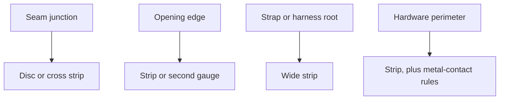
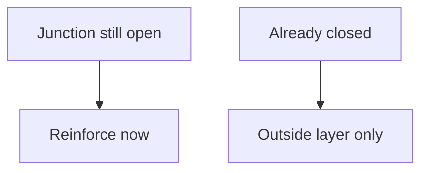

# Sheet Reinforcement Zones

> **Safety.** Solvent rubber cement is a fire hazard and an explosion hazard. *The Vanderbilt Latex Handbook* lists explosion-proof equipment, ventilation, and solvent fumes as a health hazard for solvent adhesives. Read the product SDS. Ventilate. Keep the can closed and away from heat and sparks. See [Sheet adhesives](/literature-reviews/sheet-adhesives-and-seam-integrity) and [Sheet ventilation](/literature-reviews/sheet-ventilation-solvent-exposure).

## Executive summary

Reinforcement on sheet latex is extra sheet placed where stress concentrates: a disc where seams meet, a strip along a strap root, or a second layer of gauge along an edge. Add this reinforcement while the junction is still accessible. Use this guide when planning reinforcement placement or diagnosing torn seam intersections.

Fabric-lined industrial gloves stretch less than unsupported gloves, and the textile base stops tears from propagating through the rubber film (*The Vanderbilt Latex Handbook*). On sheet latex, a local extra layer provides that same tear-stop function at high-load points.

## Questions this article answers

- [Where does the extra sheet go?](#where)
- [When do I add it?](#when)
- [What is a failed junction telling me?](#failed-junction)
- [What are the safety rules?](#safety)

## Where does the extra sheet go? {#where}

### How

Mark the target area before cutting the reinforcement piece. A reinforcement is a disc or strip placed over a stress concentration. Laminating bonds rubber sheets across a broad surface area, whereas an overlay joins two adhesive-coated edges along a seam line (see [Sheet adhesives](/literature-reviews/sheet-adhesives-and-seam-integrity)).

| Zone | What to add |
| --- | --- |
| Seam junction (three or more panels) | Disc or cross strip |
| Opening edge (neck, arm, fly) | Strip, or a second layer of gauge along the edge |
| Strap or harness root | Wide strip to distribute load |
| Hardware perimeter | Strip (for metal contact, see [Sheet hardware](/literature-reviews/sheet-hardware-metal-contact) and [Compatibility matrix](/literature-reviews/compatibility-matrix-metals-oils-plastics)) |

### Why

Supported gloves described in *The Vanderbilt Latex Handbook* stretch less than unsupported rubber gloves. The fabric backing prevents tears from propagating through the elastomeric film, increasing operational life. However, supported gloves are stiffer, harder to don and doff, and less flexible than unsupported styles.

A disc or strip applied to sheet latex acts as a localized tear-stop. Adding thickness reduces stretch at that specific point. Placing a stiff disc where a garment flexes restricts elongation locally, matching the mechanical trade-off observed in supported gloves.

Detail: Supported gloves, oil, and copper

Oil resistance of glove films documented in *The Vanderbilt Latex Handbook* ranks in increasing order: natural rubber, polychloroprene (CR), and carboxylated nitrile (XNBR). Natural-rubber films show the lowest resistance to swelling in oils, CR provides intermediate resistance, and XNBR yields the highest performance among dipped film compounds.

To control copper-catalyzed degradation in natural-rubber or polychloroprene latex films, the handbook specifies a total antioxidant loading of 2 phr (parts per hundred rubber). Approximately 1 phr addresses thermal oxidation, while the remaining 1 phr binds copper ions. Antioxidant consumed during atmospheric oxidation cannot deactivate active transition metals. For related guidance, see [Sheet hardware](/literature-reviews/sheet-hardware-metal-contact) and [Sheet aging](/literature-reviews/sheet-aging-storage-and-care).

## When do I add it? {#when}

### How

Reinforce junctions while the seam remains open and flat. Apply adhesive to the glue pathway, air it until tacky, overlay the disc or strip across the intersection, and press with a roller. For open times and adhesive selection, see [Sheet adhesives](/literature-reviews/sheet-adhesives-and-seam-integrity).

If the garment seam is already closed, reinforcement can only be added to the exterior face. The interior corner of the seam intersection remains unreinforced.

If adding a fabric reinforcement, consult [Sheet latex–textile bonding](/literature-reviews/sheet-latex-textile-bonding) before selecting cotton or synthetic fibers.

### Why

A completed seam traps the internal junction where panels intersect. An exterior patch covers the seam line, but leaves the internal focal point exposed to tear initiation. Applying reinforcement directly across the junction while flat anchors the intersecting edges before they experience peeling loads.

## What is a failed junction telling me? {#failed-junction}

### How

Inspect the location and appearance of the damage to identify the underlying mechanical or chemical failure mode:

| What you see | What to do next |
| --- | --- |
| Tear starts at a junction | Reinforce that junction on the next garment. See [Where does the extra sheet go?](#where) |
| Stiff ring at metal, then a crack | Review [Sheet aging](/literature-reviews/sheet-aging-storage-and-care) and [Sheet hardware](/literature-reviews/sheet-hardware-metal-contact) |
| Lining edge lifts | Review [Sheet latex–textile bonding](/literature-reviews/sheet-latex-textile-bonding) and [Sheet delamination](/literature-reviews/sheet-delamination-seam-failure) |

### Why

A tear through the body of a panel indicates film fatigue or puncture damage. A tear originating where multiple seam allowances meet indicates an unmanaged stress concentration. 

Cracking preceded by localized hardening around metallic hardware indicates metal-catalyzed oxidation rather than simple mechanical load. Edge lifting along an integrated backing indicates an adhesive or cohesive bond failure between the textile and the rubber film under cyclical strain.

## What are the safety rules? {#safety}

### How

Apply solvent rubber cement only in an area equipped with active ventilation. Keep adhesive containers closed when not in use. Eliminate all ignition sources, including open flames, pilot lights, and non-rated electrical motors, from the work area. Review the manufacturer Safety Data Sheet (SDS) before handling.

### Why

*The Vanderbilt Latex Handbook* notes that solvent-based rubber adhesives present severe fire, explosion, and vapor-inhalation hazards compared to waterborne latex systems. Safe handling requires dedicated mechanical ventilation and explosion-proof electrical equipment to prevent vapor accumulation and accidental ignition.

## Sources

- *The Vanderbilt Latex Handbook*. 3rd ed. Edited by Robert Francis Mausser. Norwalk, CT: R.T. Vanderbilt Company, 1987. [Library of Congress](https://lccn.loc.gov/92117844)