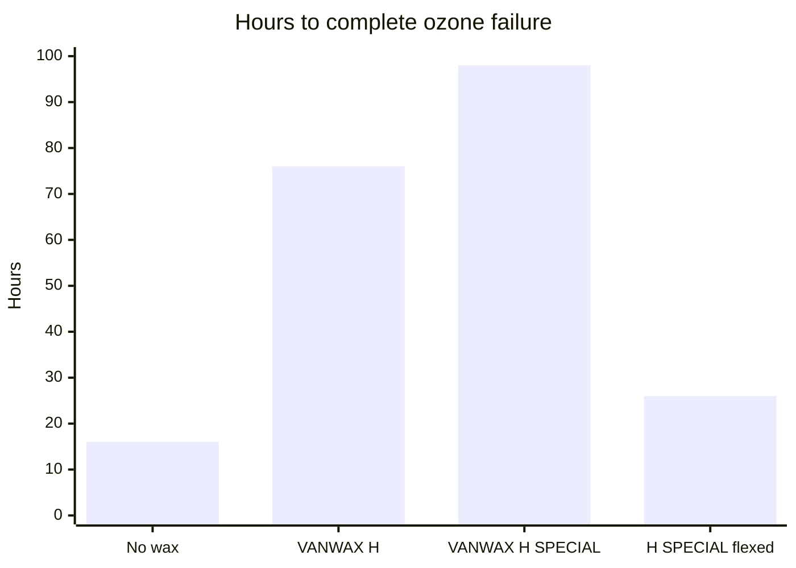

# Sheet Surface Finish

## Executive summary

Bought sheet latex can develop a light surface powder after storage. Treat that powder as possible wax bloom. This is a thin protective film that shields stationary rubber from ozone attack.

Use this guidance when stored sheet latex looks dusty before you cut, print, or apply adhesive. Cleaning the sheet removes the powder, but it also strips away that ozone barrier.

## Questions this article answers

- [How do I choose a face to join?](#faces)
- [What should I do with powder on stored sheet?](#bloom)

## How do I choose a face to join? {#faces}

### How

Make a small bond coupon on the surface you plan to join. Test both the face side and the underside of your sheet latex before assembling a full garment.

### Why

A roll of sheet latex has two distinct faces. Manufacturing methods like calendering create subtle differences in surface texture, smoothness, and release agents between each side. A quick bond test confirms which face will hold an adhesive join reliably.

Detail: Calendered sheet surface characteristics

Calendered sheet latex is manufactured by passing compounded rubber through heated steel rollers to establish a uniform gauge. Rolling mechanics produce slight differences in surface energy and micro-texture between the face side and the underside. Further details on roll geometry and processing appear in [Calendered Sheet](/literature-reviews/sheet-calendered-sheet).

## What should I do with powder on stored sheet? {#bloom}

### How

Treat a light powder on stored sheet latex as possible wax bloom. Leave it alone while the material sits on your shelf. Wipe or wash the powder away only when preparing a clean glue pathway or printing surface. Removing this layer eliminates the static ozone barrier that the wax provides.

### Why

*The Vanderbilt Latex Handbook* explains that compounders add microcrystalline wax to rubber so it migrates to the exterior. Once on the surface, the wax forms a continuous barrier that blocks atmospheric ozone. Ozone cracks natural rubber by cleaving carbon-carbon double bonds in the polymer chains.

The wax barrier works only while the sheet latex remains stationary. When rubber stretches or flexes during wear, the brittle wax layer fractures. Once fractured, ambient ozone enters the fissures and attacks the polymer underneath.

A study in *Science Diliman* on additive migration confirms that wax bloom consists of internal compounding ingredients that diffuse to the surface over time.

Detail: Wax loading, bloom time, and ozone resistance

Parts per hundred rubber (phr) expresses ingredient proportions relative to 100 parts of dry rubber hydrocarbon by weight.

*The Vanderbilt Latex Handbook* specifies microcrystalline wax emulsion loadings between 0.5 and 1.0 phr. Freshly vulcanized film lacks immediate ozone protection because the wax requires time to migrate through the matrix. In one test protocol, vulcanized films were held for three weeks at 23°C and 50% relative humidity, wrapped in kraft paper, to allow the wax to bloom.

The handbook compares time to complete ozone cracking failure under static and dynamic conditions:

| Compound formulation | Hours to complete failure |
| --- | --- |
| No wax | 16 |
| VANWAX H | 76 |
| VANWAX H SPECIAL | 98 |
| VANWAX H SPECIAL, film flexed | 26 |

Certain dark rubber compounds incorporate chemical antiozonants like p-phenylenediamine derivatives instead of, or alongside, petroleum waxes. Chemical antiozonants react directly with ozone scavengers and function under dynamic flexing. However, they cause severe contact and migration staining. Staining from chemical antiozonants is an irreversible discoloration, distinct from crystalline physical wax bloom.

## Sources

- *The Vanderbilt Latex Handbook*. 3rd ed. Edited by Robert Francis Mausser. Norwalk, CT: R.T. Vanderbilt Company, Inc., 1987. <https://lccn.loc.gov/92117844>
- “Effect of Ingredient Loading on Surface Migration Kinetics of Additives in Vulcanized Natural Rubber Compounds.” *Science Diliman*. <https://distantreader.org/stacks/journals/sciencediliman/sciencediliman-4442.pdf>