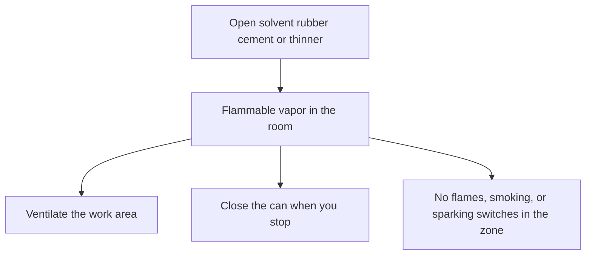

# Sheet Ventilation and Solvent Exposure

> **Safety.** Solvent rubber cement and its thinner give off flammable vapor. If you feel dizzy or nauseated, stop and get fresh air. Your local fire authority sets dwelling storage rules. This page explains the workplace and handbook frame so you can read your own can.

## Executive summary

When seaming sheet latex, you generally work with solvent rubber cement and matching thinner. Both liquids are highly flammable and release vapors that irritate the lungs and nervous system. You need active ventilation, closed containers between uses, and zero ignition sources in the room.

## Questions this article answers

- [What should you do while the can is open?](#while-the-can-is-open)
- [How should you store solvent rubber cement cans?](#storing-the-cans)

## What should you do while the can is open? {#while-the-can-is-open}

### How

1. Read the safety data sheet for your specific cement and thinner before starting.
2. **Apply** cement only in a well-ventilated room.
3. Close the container immediately after dispensing adhesive onto your applicator or work surface.
4. Keep open flames, lit smoking materials, and sparking switches out of the room. If liquid spills on your clothes, remove them and wash your skin immediately.
5. Ground and bond containers when transferring liquid if your product safety data sheet requires it.

### Why

Heptane-based rubber cements fall under flammable liquid Category 2, bearing hazard statement H225. This classification requires cool, well-ventilated storage kept far from heat, sparks, and open flames.

The NIOSH Pocket Guide lists n-heptane as a Class IB flammable liquid with a flash point of 25°F (-4°C). Its lower explosive limit is 1.05% and its upper explosive limit is 6.7% by volume in air. The flash point is the lowest temperature at which liquid produces enough vapor to ignite in air. Explosive limits define the concentration range where that vapor can burn or explode. NIOSH notes that inhaling n-heptane causes dizziness, nausea, and stupor.

*The Vanderbilt Latex Handbook* notes that solvent adhesives introduce fire hazards, explosion risks, and toxic solvent fumes, demanding dedicated ventilation and explosion-proof electrical equipment. In its laboratory chapter, the handbook specifies that work areas handling volatile solvents must remain well ventilated, all electrical gear must be grounded, and flammable zones require explosion-proof motors and switches.

OSHA standard 29 CFR 1910.106(e)(2)(iv)(c) states that Category 1 or 2 flammable liquids can only be used where no open flames or ignition sources sit within the possible path of vapor travel. Paragraph 1910.106(d)(7)(iii) forbids open flames and smoking inside flammable-liquid storage locations, and paragraph 1910.106(e)(6)(i) identifies smoking, open flames, and electrical arcing as ignition sources that must be controlled.

Detail: What the handbook lists for solvent adhesives

*The Vanderbilt Latex Handbook* (3rd ed., 1987) compares solvent adhesives with water-based latex adhesives. It identifies several distinct performance advantages for solvent adhesives:

- High early bond strength and quick tack
- Water resistance
- Broad range of drying rates and open assembly times
- Reliable wetting on difficult substrates

The handbook pairs those advantages with severe process drawbacks:

- Direct fire and explosion hazards
- Requirement for explosion-proof switches, motors, and ventilation
- Inhalation toxicity from continuous solvent fumes
- Potential need for industrial solvent recovery systems

By contrast, the latex adhesive entry on that comparison table features nonflammable formulations and water carrier systems.

Detail: n-Heptane numbers on the NIOSH card

NIOSH Pocket Guide entry for n-heptane (CAS 142-82-5):

- Flash point: 25°F (-4°C)
- Lower explosive limit (LEL): 1.05%
- Upper explosive limit (UEL): 6.7%
- Class IB flammable liquid: flash point below 73°F (23°C) and boiling point at or above 100°F (38°C)
- Boiling point: 209°F (98°C)
- Chemical incompatibilities: strong oxidizers
- Personal exposure guidance: prevent skin and eye contact, wash contaminated skin promptly, and remove liquid-soaked clothing immediately

Commercial rubber cements often use proprietary solvent blends, such as light aliphatic naphtha mixed with heptane isomers. Always check the safety data sheet for your exact brand SKU rather than assuming pure n-heptane constants.

## How should you store solvent rubber cement cans? {#storing-the-cans}

### How

- Store solvent rubber cement and thinner containers tightly closed in a cool, dry, well-ventilated area.
- Keep cans away from direct heat sources, open flames, sparks, and strong oxidizers.
- Check residential storage limits with your local municipal fire department or fire marshal.

### Why

OSHA 29 CFR 1910.106 defines a closed container as an enclosure sealed by a lid or cap so that neither liquid nor vapor escapes at ordinary ambient temperatures. Storing solvent cements in unsealed jars allows volatile fractions to flash off into the room.

Oregon OSHA Fact Sheet FS-12 summarizes 1910.106 rules, outlining flash point categories, container specifications from Table H-12, and segregation rules for incompatible chemicals. However, workplace safety standards apply to commercial facilities, not residential homes. Local fire codes govern chemical quantities permitted in private residences.

Detail: Scope of 29 CFR 1910.106 and FS-12

OSHA 29 CFR 1910.106 regulates industrial storage, fluid dispensing, and manufacturing operations. The requirement for sealed containers ensures that ambient vapor pressures remain contained, preventing flammable concentrations from accumulating near floor level.

Oregon OSHA FS-12 emphasizes that full compliance requires checking container volume caps against Table H-12 and reviewing chemical compatibility before storing solvents next to other workshop materials. The document explicitly advises operators to consult local fire marshals for structural and municipal restrictions.

Industrial standard 1910.106(e)(3)(v) specifies mechanical ventilation for certain plant process areas using Category 1 or 2 flammable liquids at a minimum rate of 1 cubic foot per minute per square foot of floor space, discharged directly outdoors. This formula applies strictly to industrial plants under subsection (e)(3)(i), not domestic rooms or residential craft areas.

## Sources

- *The Vanderbilt Latex Handbook*. 3rd ed. Edited by Robert Francis Mausser. Norwalk, CT: R.T. Vanderbilt Company, Inc., 1987. https://lccn.loc.gov/92117844
- OSHA. 29 CFR 1910.106, Flammable liquids. United States Department of Labor. https://www.osha.gov/laws-regs/regulations/standardnumber/1910/1910.106
- NIOSH Pocket Guide to Chemical Hazards: n-Heptane. Centers for Disease Control and Prevention. https://www.cdc.gov/niosh/npg/npgd0312.html
- Oregon OSHA. Fact Sheet: Flammable Liquids (FS-12), summary of 1910.106. Department of Consumer and Business Services. https://osha.oregon.gov/OSHAPubs/factsheets/fs12.pdf
- Manufacturer Safety Data Sheets (SDS) for solvent rubber cement and thinner formulations (Flam. Liq. 2, H225).