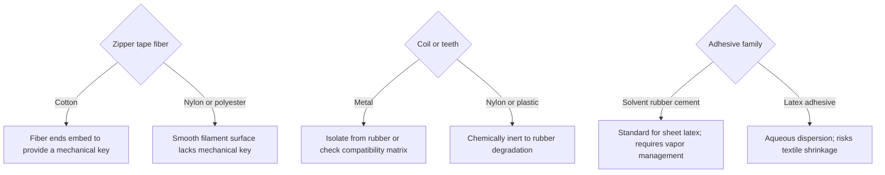

# Sheet Zipper Closure Compatibility

> **Safety.** Bonding a zipper to sheet latex uses solvent rubber cement. That adhesive family is a fire and health hazard from volatile solvents. Read the product safety data sheet (SDS) before use. Ensure local exhaust or cross-ventilation. See [Sheet adhesives](/literature-reviews/sheet-adhesives-and-seam-integrity) and [Sheet ventilation](/literature-reviews/sheet-ventilation-solvent-exposure).

## Executive summary

When you select a zipper for sheet latex garments, inspect three distinct components: the woven tape, the coil or teeth, and the stops. Industrial rubber literature evaluates fibers based on cord and heavy fabric reinforcements. Cotton provides protruding staple fibers that create a mechanical key in rubber, whereas smooth synthetic filaments like nylon or polyester lack this mechanical interlock. Keep metal coils and stops away from direct rubber contact unless tested for non-reactive metals, and apply solvent rubber cement on sheet latex seam allowances.

## Questions this article answers

- [Which zipper parts matter on sheet?](#which-parts)
- [Cotton tape or a slick nylon or polyester tape?](#cotton-or-slick)
- [How do I choose coil and adhesive?](#choose)
- [What does ASTM D2054 test?](#d2054)

## Which zipper parts matter on sheet? {#which-parts}

### How

Inspect each zipper component before you mark and cut your sheet latex:

| Part | What to check |
| --- | --- |
| Woven tape | Identify whether the tape is staple cotton, continuous filament nylon, or polyester. |
| Coil or teeth | Choose nylon coil or molded plastic teeth over raw metal. Route metal components per [Sheet hardware](/literature-reviews/sheet-hardware-metal-contact). |
| Stops and pull | Check whether top and bottom stops are plastic or bare metal, especially where they rest on the glue pathway. |

For procedures on bonding seams, consult [Sheet adhesives](/literature-reviews/sheet-adhesives-and-seam-integrity). For broader textile backing guidelines, refer to [Sheet latex–textile bonding](/literature-reviews/sheet-latex-textile-bonding).

### Why

The tape face is the surface that bonds directly to the rubber. The teeth or coil form a separate mechanical closure. Stops terminate the coil travel and frequently overlap the seam allowance where adhesive is applied. If metal stops contain copper or brass, direct contact will catalyze oxidative degradation in natural rubber.

## Cotton tape or a slick nylon or polyester tape? {#cotton-or-slick}

### How

Check the fiber construction of your zipper tape before you apply adhesive:

1. Identify whether the tape consists of spun cotton staple fibers or smooth filament yarns like nylon or polyester.
2. Maintain an adequate seam allowance overlap along the glue pathway where the tape meets the rubber edge.
3. For sheet latex, apply solvent rubber cement to join the tape to the rubber face. Avoid latex adhesive here, as water-based formulations can cause textile shrinkage and wrinkle the seam.

### Why

Cotton is a staple fiber composed of short individual strands spun together. Loose fiber ends project outward from the yarn surface. When you apply adhesive, these fiber ends embed directly into the rubber matrix, establishing a mechanical key. 

In contrast, industrial continuous filaments like rayon, nylon (polyamide), and polyester have smooth, waxy surfaces without free fiber ends. Without these projecting ends, the rubber cannot interlock mechanically. 

On a porous substrate, bonding depends primarily on this mechanical entrapment. On a non-porous or smooth face, adhesion requires matched chemical polarity between the substrate and the bonding polymer. Because natural rubber has very low polarity, it does not naturally wet or bond well to smooth, higher-polarity synthetic filaments.

Detail: Abrasion and textile dipping mechanisms

D. C. Blackley examines tire-cord adhesion in *High Polymer Latices* (1966) and *Polymer Latices* (1997). Both editions evaluate high-tenacity continuous filament rayon bonded to natural rubber. 

A mechanical roughening or abrasion step increases static adhesion by scratching the filament surface. However, under dynamic flexing tests, surface abrasion alone yields little lasting improvement unless followed by a resorcinol-formaldehyde-latex or protein-latex dip. The mechanical roughening and chemical bonding treatment together outperform either single intervention. 

The 1966 edition labels the dip a latex–casein adhesive, while the 1997 text refers to a latex–casein abrasive. Both reference the same continuous filament cord test protocol.

Detail: Substrate polarity bands

*The Vanderbilt Latex Handbook* (1987) specifies that when joining non-porous surfaces, adhesive latex polarity should match substrate polarity:

- **High polarity:** Acrylonitrile-butadiene (NBR), carboxylated nitrile (XNBR), carboxylated styrene-butadiene (XSBR), and pyridine-styrene-butadiene (PSBR).
- **Medium polarity:** Polychloroprene (CR) and polyvinyl chloride (PVC).
- **Low polarity:** Natural rubber (NR), styrene-butadiene (SBR), polybutadiene (BR), and butyl rubber (IIR).

Rani Joseph reinforces this distinction in *Practical Guide to Latex Technology* (2013). Porous substrates rely primarily on mechanical anchoring, reducing the necessity of matching chemical polarities. Non-porous or smooth synthetic surfaces require aligned polarities or specialized functional latices containing carboxyl or vinylpyridine groups to generate cohesive bond strength.

## How do I choose coil and adhesive? {#choose}

### How

Match your zipper materials and adhesive system using this process flow:

Use nylon coils or molded plastic teeth whenever possible. If you must use metal closures, verify the alloy against the [Compatibility matrix](/literature-reviews/compatibility-matrix-metals-oils-plastics) to prevent contact degradation. Always apply solvent rubber cement when working with sheet latex.

### Why

Solvent rubber cement bonds sheet latex through contact tack as the solvent evaporates. This avoids saturating woven zipper tapes with water, which prevents local puckering. Plastic coils eliminate the risk of copper-induced catalytic breakdown of natural rubber chains.

## What does ASTM D2054 test? {#d2054}

### How

Consult ASTM D2054 test data strictly to evaluate colorfastness and dye stability on the zipper tape. Do not use this standard to estimate peel strength or adhesive compatibility with natural rubber.

### Why

ASTM D2054 measures crocking, which is the tendency of dye or surface pigment to rub off a zipper tape under mechanical friction. It serves as an indicator of textile dye quality, but it provides no measurement of polymer adhesion, surface energy, or interfacial bond integrity with rubber.

## Sources

- ASTM International. *ASTM D2054: Test Method for Colorfastness of Zipper Tapes to Crocking*. West Conshohocken, PA: ASTM International.
- Blackley, D. C. *High Polymer Latices: Their Science and Technology*. 2 vols. London: Maclaren; New York: Palmerton, 1966. https://lccn.loc.gov/66077950
- Blackley, D. C. *Polymer Latices: Science and Technology — Volume 3: Applications of Latices*. 2nd ed. London: Chapman & Hall; New York: Springer, 1997. https://books.google.com/books?id=Y2VPGj7YbykC
- Joseph, Rani. *Practical Guide to Latex Technology*. Shawbury: Smithers Rapra Technology, 2013. https://books.google.com/books/about/Practical_Guide_to_Latex_Technology.html?id=NB5AMwEACAAJ
- Mausser, Robert Francis, ed. *The Vanderbilt Latex Handbook*. 3rd ed. Norwalk, CT: R.T. Vanderbilt Company, 1987. https://lccn.loc.gov/92117844