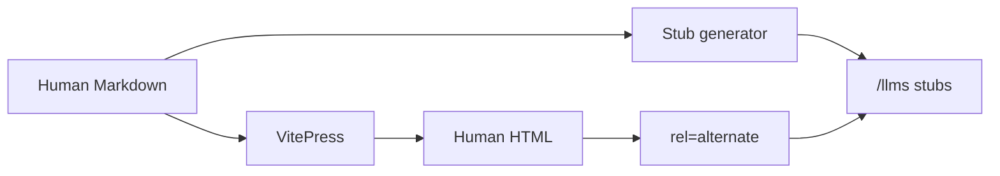

# Agent surface demo

Infrastructure check page — not a lesson. Confirms block math, Mermaid fences, a video with a transcript link, and the agent Markdown alternate.

## Block math

Coverage ratio for a rectangular panel (illustrative):

$$
\frac{W_{\text{finished}}}{W_{\text{pattern}}} = s
$$

## Mermaid

## Video + transcript

Placeholder embed; transcript link is required for video pages.

<YouTubeEmbed videoId="dQw4w9WgXcQ" title="Placeholder — agent surface demo" transcript="/transcripts/agent-surface-demo.md" />
